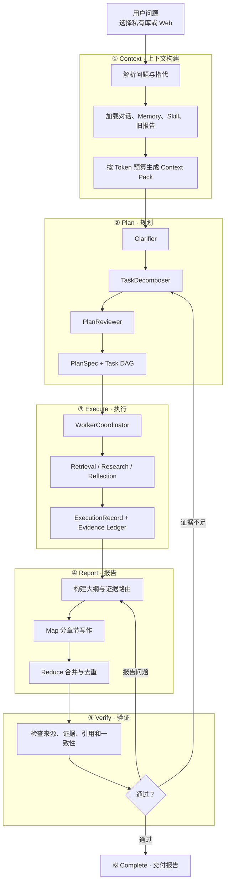
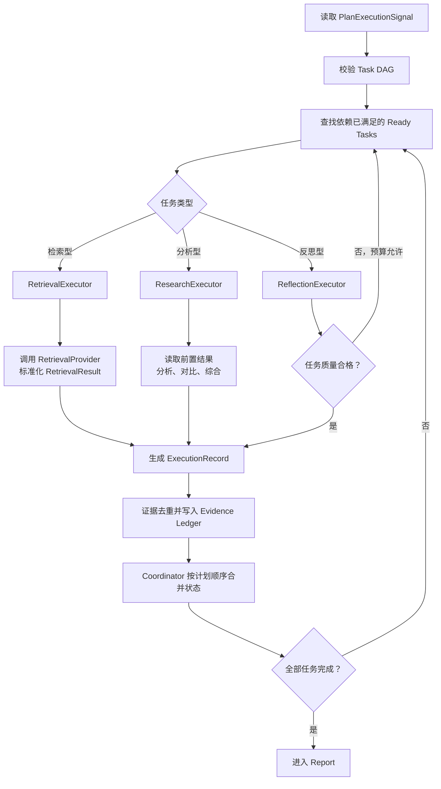

# Agent 设计文档

> 本文描述 `plan_execute_report` 工作流，重点说明 Context、Plan、Execute、Report、Verify 与 Harness 的协作关系。

## 1. 设计目标

系统面向需要多轮检索、复杂分析和长报告交付的研究任务。它不把一次 LLM 调用视为完整结果，而是将任务拆成可规划、可执行、可验证、可恢复的多个阶段。

核心目标：

- 将自然语言问题转换为结构化 Task DAG；
- 将会话、Memory、Skill 和旧报告组装为受预算约束的上下文；
- 让多个 Worker 串行或并行完成检索、分析和反思；
- 用 Evidence Ledger 连接来源、任务、结论和引用；
- 报告通过质量门禁后才能完成；
- 长任务支持实时进度、取消、重试、重规划和断点恢复。

## 2. 主流程



主状态流：

```text
queued → context_building → planning → executing
       → reporting → verifying → completed
```

异常时可能进入 `needs_user_input`、`retrying`、`replanning`、`interrupted`、`cancelled`、`failed` 或 `budget_exhausted`。

## 3. Context：上下文构建与注入

### 3.1 输入

Context Builder 接收已持久化的 `RunContext`，其中包括：

- Run、Session 和触发消息 ID；
- 原始问题、SourceMode 与 WorkflowMode；
- 配置、模型与预算快照；
- 取消标记、Checkpoint 版本和恢复位置。

### 3.2 Context Pack

| Context Block | 用途 | 当前 Run 的研究证据 |
|---|---|---:|
| System Contract | 来源隔离和完成规则 | 否 |
| Current Task | 当前问题、消歧结果和假设 | 否 |
| Recent Messages | 理解连续追问 | 否 |
| Session Summary | 压缩长会话 | 否 |
| Curated Memory | 用户偏好、稳定事实和决策 | 否 |
| Historical Recall | 按需召回相关 Session | 否 |
| Selected Skill | 注入已审核的程序性策略 | 否 |
| Artifact Edit Contract | 指定旧报告中要修改的章节 | 否 |
| Retrieval Evidence | 本 Run 通过工具取得的来源材料 | **是** |

构建过程：

1. `QueryResolver` 消解“它”“上一部分”等指代；
2. `ContextCompactor` 生成或更新 Session Summary；
3. 加载冻结的 Memory Snapshot；
4. 必要时执行跨 Session 的 FTS5 Recall；
5. `SkillLoader` 选择与问题和 SourceMode 兼容的 Skill；
6. 检测是否属于旧报告章节修改；
7. 按优先级、字符数和 Token 上限组装 Context Pack；
8. 生成 `context_snapshot` 与 `model_input` 并保存 Checkpoint。

Context Pack 被放入 `PlanExecuteState.context_snapshot`。Planner 使用已消歧问题和策略，Worker 使用任务与前置结果，Reporter 使用 Plan、ExecutionRecord 与 Evidence Card，Verifier 使用报告和 Evidence Ledger。

如果系统无法可靠消解指代，则进入 `needs_user_input`，用户补充信息后继续同一个 Run。

## 4. Plan：结构化规划

Planner 的内部流程为：

```text
Clarifier → TaskDecomposer → PlanReviewer → PlanSpec
```

### 4.1 Clarifier

检查主体、范围、时间和输出要求是否明确。关键歧义无法安全推断时，暂停 Run 并向用户提问。

### 4.2 TaskDecomposer

将复杂问题拆成多个 `TaskNode`，并建立 `depends_on` 关系。例如：

```text
T1 市场规模 ─┐
T2 主要厂商 ─┼→ T4 综合竞争格局 → T5 整体反思
T3 政策风险 ─┘
```

主要任务类型包括检索任务、深度研究任务、链式探索、Reflection 与 Custom Task。

### 4.3 PlanReviewer

检查 Task ID、依赖是否存在、DAG 是否有环、任务类型和参数是否合法、SourceMode 是否一致，以及验收标准是否完整。

### 4.4 PlanSpec

```text
PlanSpec
├── plan_id / version / status
├── source_mode
├── problem_statement
├── assumptions
├── task_graph
│   ├── TaskNode[]
│   └── execution_mode
└── acceptance_criteria
```

短且明确的概括、总结或列表问题可以走单任务快速路径，避免构建不必要的复杂 DAG。

## 5. Execute：多 Worker 执行



### 5.1 WorkerCoordinator

Coordinator 负责依赖判断、Executor 路由、并发控制、状态隔离和确定性合并：

- `sequential`：按拓扑顺序串行执行；
- `parallel`：依赖已满足的 Task 进入线程池；
- `adaptive`：当前实现降级为串行。

并行 Worker 使用共享状态的深拷贝独立执行，完成后由 Coordinator 按 Plan 顺序合并局部结果，避免并发修改共享列表导致竞态。

### 5.2 RetrievalExecutor

读取 `query`、`top_k`、检索深度和过滤条件，调用当前 Run 的 Retrieval Provider，将工具输出统一为 `RetrievalResult`，同时记录工具参数、耗时、状态和结果 ID。

```text
graphrag → Neo4j / Faiss → local / global / hybrid / naive
web      → Tavily        → web_search
```

一个 Run 冻结一种 SourceMode，检索失败时不会跨源降级。

### 5.3 ResearchExecutor

读取前置 Task 的中间结果，执行分析、比较、综合和链式探索，为后续任务及 Reporter 形成结构化中间结论。

### 5.4 ReflectionExecutor

检查任务是否真正得到回答、证据覆盖是否充分、工具是否失败以及是否需要重试目标任务。

```text
Reflection Retry：重新执行一个 Task
Harness Replan：重新生成整个 PlanSpec
```

### 5.5 依赖失败

- `dependency_failed`：前置任务失败；
- `dependency_missing`：依赖的 Task ID 不存在；
- `dependency_unresolved`：依赖无法完成或图存在未解析问题。

失败也会生成结构化 ExecutionRecord，供恢复、审计和前端解释。

### 5.6 ExecutionRecord

```text
ExecutionRecord
├── record_id / task_id / session_id
├── worker_type
├── inputs
├── tool_calls[]
├── evidence[]
├── reflection
└── metadata
    ├── latency_seconds
    ├── token_usage
    ├── tool_calls_count
    └── evidence_count
```

## 6. Evidence Ledger

Evidence Ledger 使用稳定 `evidence_id` 连接整条证据链：

```text
来源 → ToolCall → TaskNode → ExecutionRecord
    → Evidence Card → 报告 Claim / Citation → Verification
```

原始证据不会因上下文压缩而删除。Reporter 使用压缩后的 Evidence Card 写作，但每张 Card 都必须回指原始证据。

## 7. Report：证据驱动写作

Reporter 消费用户目标、PlanSpec、ExecutionRecord、Evidence Ledger、报告类型和相关策略。

```text
OutlineBuilder
  → Evidence Card 构建与章节路由
  → Map：分批提炼和章节写作
  → Reduce：合并、精炼和去重
  → ReportAssembler
  → ConsistencyChecker
  → Citation Formatter
```

当证据上下文超过章节预算时，系统执行分批 Map、Digest 和递归 Reduce。Harness 还会为 Report 和 Verify 预留 Token；执行阶段接近上限时，可以进入确定性 Evidence Card 报告模式。

### 7.1 旧报告局部修改

用户可在同一 Session 中要求只修改某个明确章节。`ArtifactEditContextBuilder` 会定位最近报告的目标章节、保存其他章节 SHA-256、生成替换内容，并在合并后校验非目标章节保持不变。

如果用户先用私域资料生成报告，再切换到 Web 补充网络信息，系统会创建新的 Web Run。旧报告是编辑对象，新增加的事实必须由新 Run 的 Web Evidence 支持。

## 8. Verify：完成门禁

Completion Contract 包括：

| 检查 | 目的 |
|---|---|
| `source_match` | 证据必须来自当前 SourceMode |
| `min_evidence` | 达到最低证据数量 |
| `citation_integrity` | 引用指向存在的 Evidence |
| `claim_support` | 核心结论有证据支持 |
| `report_consistency` | 内容与证据及内部逻辑一致 |
| `required_section` | 必选章节完整 |
| `source_diversity` | 来源多样性满足要求 |
| `evidence_card_coverage` | Ledger 证据未被静默遗漏 |

验证结果对应三种主要动作：

```text
全部通过             → completed
文字、结构或引用问题 → repair_report → reporting
证据或规划问题       → replan → planning
无法恢复或预算耗尽   → failed / budget_exhausted
```

## 9. Harness：全流程运行保障

Harness 不是一个独立研究节点，而是覆盖所有阶段的 Runtime。

### 9.1 状态与预算

状态机阻止 Run 跳过 Context、Report 或 Verify 直接完成。预算覆盖 LLM Token、ToolCall 次数、工具超时、最大并发、Task Retry、Replan 和墙钟时间。

### 9.2 Checkpoint 与恢复

关键阶段保存版本化 Checkpoint，其中包含 RunContext、Context Snapshot、Plan、ExecutionRecord、Report State 和预算用量。服务中断后从经过验证的安全阶段继续。

### 9.3 幂等、取消与隔离

- 相同客户端消息不会重复创建多个 Run；
- ToolCall 使用唯一 ID，降低恢复时重复副作用；
- 并行 Worker 不直接修改共享状态；
- Run 创建后冻结 SourceMode、WorkflowMode、模型和预算快照；
- 用户停止后取消后续模型和工具调用，已保存轨迹仍可审计。

## 10. 用户端表现

后端通过 SSE 将运行事件推送到 React Console。

| 后端能力 | 用户感知 |
|---|---|
| Context 完成 | 显示复用消息、Memory、历史召回和 Token |
| Plan 创建或修订 | 显示任务数量与计划变化 |
| Task / Tool 事件 | 实时显示正在研究什么、结果数和异常 |
| Evidence 入账 | 实时增加证据数量并支持查看来源 |
| Retry / Replan | 展示自动重试、重新规划和原因 |
| Report 完成 | 展示报告内容及 HTML 导出入口 |
| Verification | 展示质量检查及自动修复动作 |
| Clarification | 暂停并让用户补充信息后继续 |
| Cancel | 停止任务并终止后续预算消耗 |

用户端主画布对应：

```text
上下文构建 → 规划 → 执行研究 → 报告 → 验证 → 完成
```

## 11. 关键对象

| 对象 | 作用 |
|---|---|
| Session | 管理多轮消息、摘要和 Memory Snapshot |
| RunContext | Harness 可序列化运行状态 |
| Context Snapshot | 固定本 Run 的上下文来源和 Token 用量 |
| PlanSpec / TaskGraph | 定义问题、任务依赖和验收标准 |
| PlanExecutionSignal | 将可执行计划传递给 Coordinator |
| ExecutionRecord | 保存 Task 输入、工具、证据、反思和指标 |
| Evidence | 支撑引用、验证和审计 |
| ReportResult | 保存大纲、章节、报告与一致性结果 |
| ContractCheck | 保存单项质量门禁结果 |
| Checkpoint | 支撑中断恢复和完整性验证 |

## 12. 代码映射

| 能力 | 实现位置 |
|---|---|
| Harness Runtime | `src/deepresearch_agent/harness/runtime.py` |
| RunContext / Contract | `src/deepresearch_agent/harness/` |
| Context Builder | `src/deepresearch_agent/context/builder.py` |
| 报告局部编辑 | `src/deepresearch_agent/context/artifact_edit.py` |
| Plan–Execute–Report Driver | `src/deepresearch_agent/harness/workflow.py` |
| Orchestrator | `src/deepresearch_agent/agents/multi_agent/orchestrator.py` |
| Planner | `src/deepresearch_agent/agents/multi_agent/planner/` |
| WorkerCoordinator / Executor | `src/deepresearch_agent/agents/multi_agent/executor/` |
| Reporter | `src/deepresearch_agent/agents/multi_agent/reporter/` |
| Retrieval Provider | `src/deepresearch_agent/retrieval/` |
| API 调度 | `backend/app/services/run_service.py` |
| 前端研究画布 | `frontend/src/pages/ChatPage.tsx` |

## 13. 当前边界

- 一个 Run 只支持一种 SourceMode；
- `adaptive` 调度当前降级为串行；
- 聊天界面尚未形成完整的临时附件上传和即时索引链路；
- 报告局部编辑要求用户明确指出唯一章节；
- 当前单进程调度适合本地 MVP，横向扩展需要分布式队列与共享 Lease。

## 14. 总结

`plan_execute_report` Agent 将复杂问题变成可执行计划、可追踪任务、可引用证据和结构化报告；Harness 通过上下文治理、状态机、预算、Checkpoint、事件和 Completion Contract，保证整条链路能够可靠运行并交付可信结果。
